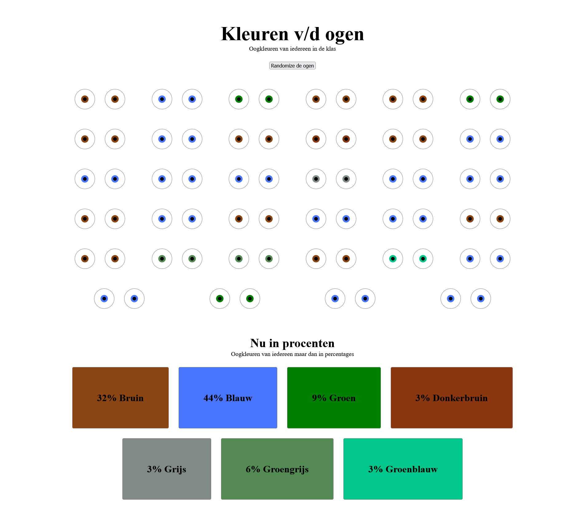
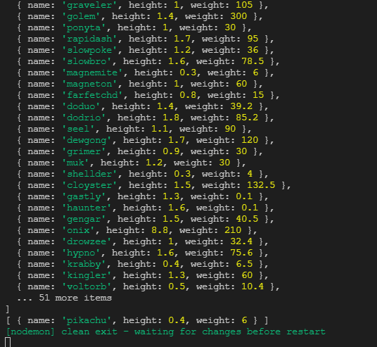

# ⚙ Front-end Applications - Functional programming

### Eye-color visualisation



### Pokemon comparison



## 📂 Assignment

The assignment of functional programming is to apply functional programming principles and using it to process and clean data from an (open) API/JSON file.

## 🧾 Table of contents
  * [📂 Assignment](#---assignment)
  * [🧾 Table of contents](#---table-of-contents)
  * [📖 About the project](#---about-the-project)
    + [🛠 Built with](#---built-with)
    + [📅 Dataset used](#---dataset-used)
  * [🔍 Getting started](#---getting-started)
    + [🔨 Installation](#---installation)
  * [🧰 Packages/dependecies](#---packages-dependecies)
    + [🧱 Dependecies](#---dependecies)
    + [🧱 Dev dependecies](#---dev-dependecies)
  * [📑 Sources](#---sources)
  * [🔖 License](#---license)

## 📖 About the project

This project consists out of two applications, one a Pokemon comparetor and one a Eye color visualisation, for the Pokemon comperator i used an open API called PokeAPI, to get all Pokemons that ever existed in the Pokemon franchise, for the eye color visualisation we used a form that we filled in ourselfs.
During the project i logged everyday in a [logbook](), if you want to read specific thing that i did from day to day read the [logbook]().
There is also a wiki with detailed information.

### 🛠 Built with

This application is built with [NodeJs](https://nodejs.org/en/) and extra packages etc.:

-   [🧰 Packages/dependecies](#---packages-dependecies)
-   [PokeAPI](https://pokeapi.co/)  

### 📅 Dataset used
Because this repo contains two projects i used two datasets:
- The dataset from the form that we had to fill in:
  A single object looks like this:
  ```JSON
    {
      "favourite-pet": "kat",
      "eye-color": "Bruin",
      "favourite-wind-direction": "Oost",
      "excitement-for-tech-track": 7,
      "choose-to-answer-this-question": "Oke",
      "favourite-date": "15/01/1999",
      "favourite-date-in-text": "vijftien januari negentiennegenennegentig",
      "favourite-dairy-product": "Melk",
      "clothing-colors": "Zwart, Grijs",
      "favourite-floor-to-study": 2,
      "future-occupation": "Frontend developer",
      "future-occupation-eight-year-old": "Piloot",
      "is-cheese-a-mammal": "Wat.",
      "future-car-brand": "Mercedes C63 AMG"
    },
  ```
- The dataset from an API, i used the PokéAPI.
  I pasted a small snippet of the JSON file that is being imported:
  ```JSON
  {
  "abilities": [
    {
      "ability": {
        "name": "limber",
        "url": "https://pokeapi.co/api/v2/ability/7/"
      },
      "is_hidden": false,
      "slot": 1
    },
    {
      "ability": {
        "name": "imposter",
        "url": "https://pokeapi.co/api/v2/ability/150/"
      },
      "is_hidden": true,
      "slot": 3
    }
  ],
  ```
  
## 🔍 Getting started

Before using these files you need to install them first, continue below here to install the application.

### 🔨 Installation

1. Open your terminal, or the terminal in your IDE

2. Clone the repository

```
git clone https://github.com/KoenHaagsma/TechTrack-Frontend-Applications.git
```

3. Go to the conled repository

```
cd ../../Techtrack-Frontend-Applications
```

4. Install all packages

```
npm install || npm i
```

5. Start the application for development

```
npm run dev
```

6. Open the server in your browser [Localhost](http://localhost:3000/). If this doesn't work change the port 3000 till something else.

## 🧰 Packages/dependecies

### 🧱 Dependecies

-   [express](https://www.npmjs.com/package/express)
-   [pug](https://www.npmjs.com/package/pug)
-   [colornames](https://www.npmjs.com/package/colornames)

### 🧱 Dev dependecies

-   [nodemon](https://www.npmjs.com/package/nodemon)

## 📑 Sources

-   [Sources](https://github.com/KoenHaagsma/TechTrack-Frontend-Applications/wiki/%F0%9F%96%BC-Bronnen)

## 🔖 License

[](https://github.com/KoenHaagsma/TechTrack-Frontend-Applications/blob/main/LICENSE)
